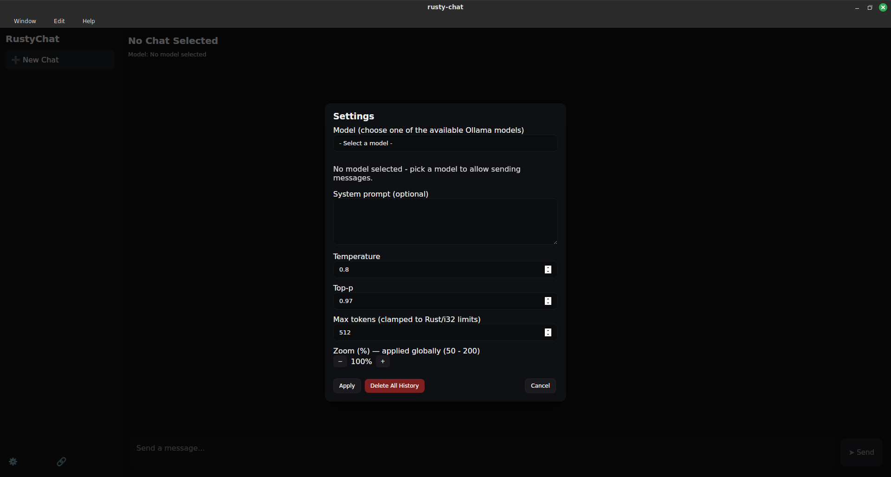
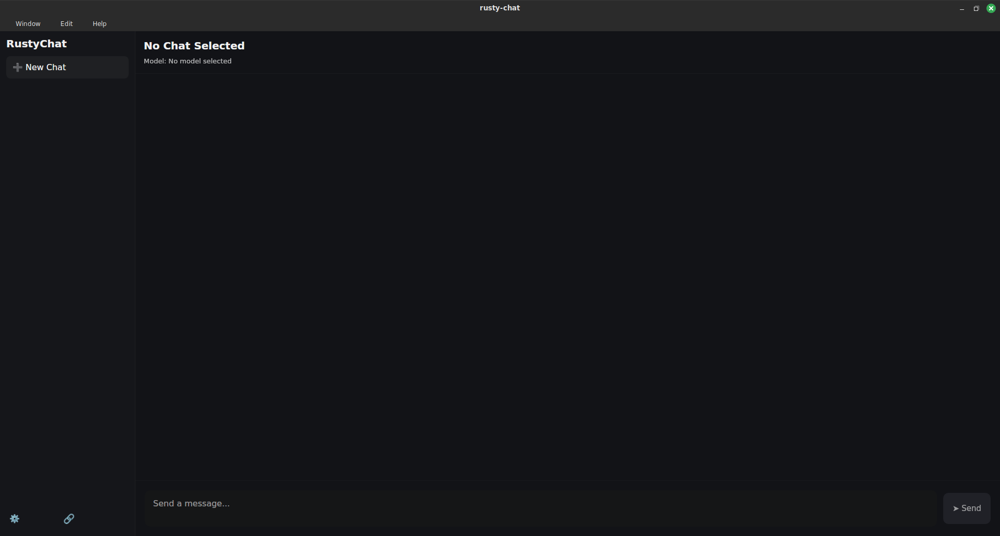

<div align="center">


# overlooked

**A native, Rust-built desktop chat client for local Ollama and any OpenAI-compatible API.**

OpenAI · Anthropic · DeepSeek · Gemini · Kimi · GLM · Qwen · Yi · Mistral · xAI · Groq · OpenRouter · Together · Fireworks · Cerebras · Perplexity · NVIDIA NIM · DeepInfra · Ollama · LM Studio — all from one window.

[](https://www.rust-lang.org/)
[](https://dioxuslabs.com/)
[](LICENSE)
[](https://github.com/KPCOFGS/overlooked/releases)

</div>

---

GPT-style desktop chats faded from the conversation. Rust has the toolchain, the safety story, and the runtime — and almost nobody is shipping a serious native chat client for it. This is that client.

## Why overlooked

- **One binary, ~11 MB.** No Electron, no Node, no Python sidecar.
- **Local first, cloud ready.** Talk to Ollama or LM Studio on `localhost`, or drop in any OpenAI-compatible API key.
- **Real streaming** for both Ollama (NDJSON) and OpenAI-format (SSE) — tokens appear as they arrive, with a real Stop button.
- **20+ provider presets.** Pick one, the base URL and per-provider chat path are filled in for you.
- **Built-in web search** (Tavily) as a function-calling round-trip. Toggle it per session.
- **Multi-user** with per-user chats, settings, themes, and avatars. Argon2 password hashing.
- **Light + dark themes** plus a custom accent color.
- **Local-first storage.** Everything (chats, keys, avatars) lives in a single `chat.db` SQLite file on your machine. No telemetry.

## Download

The fastest way to try it: grab the latest pre-built binary from the **[Releases page](https://github.com/KPCOFGS/overlooked/releases)** for your OS. Unzip and run — no installer needed.

If a release isn't up for your platform yet, see [Build from source](#build-from-source) below.

## Screenshots

<table>
<tr>
<td></td>
<td></td>
</tr>
<tr>
<td align="center"><sub>Light theme</sub></td>
<td align="center"><sub>Dark theme</sub></td>
</tr>
</table>

## Supported providers

| Provider | Auth | Notes |
| --- | --- | --- |
| Ollama (local) | none | Default `http://localhost:11434` |
| LM Studio (local) | none | OpenAI-compatible at `http://localhost:1234` |
| OpenAI | API key | gpt-4o, gpt-4o-mini, o1, o3-mini |
| Anthropic Claude | API key | claude-opus-4-7, claude-sonnet-4-6, claude-haiku-4-5 |
| DeepSeek | API key | deepseek-chat, deepseek-reasoner |
| Google Gemini | API key | gemini-2.0-flash, gemini-1.5-pro |
| xAI Grok | API key | grok-4, grok-2-latest |
| Mistral | API key | mistral-large-latest, codestral-latest |
| Moonshot Kimi | API key | kimi-k2, moonshot-v1-128k |
| Zhipu GLM | API key | glm-4.5, glm-4-plus, glm-4-air |
| Alibaba Qwen | API key | qwen-max, qwen-plus, qwen-turbo |
| 01.AI Yi | API key | yi-large, yi-medium |
| Groq | API key | llama-3.3-70b, mixtral-8x7b |
| Cerebras | API key | llama3.1-70b, llama-3.3-70b |
| Perplexity | API key | sonar, sonar-pro, sonar-reasoning |
| OpenRouter | API key | Any model in the OpenRouter catalog |
| Together AI | API key | Llama, Mistral, DeepSeek, Qwen, ... |
| Fireworks AI | API key | accounts/fireworks/models/* |
| DeepInfra | API key | Llama, DeepSeek, Mistral, ... |
| NVIDIA NIM | API key | nvidia/* and meta/* hosted models |
| Custom | optional | Any OpenAI-compatible endpoint |

## Quick start

1. Open the app.
2. Click **Settings** in the bottom-left of the sidebar.
3. **Provider** → pick yours. The base URL fills in automatically.
4. Paste your **API key** (Ollama and LM Studio need none).
5. **Model** → pick from the live-fetched dropdown, or type your own.
6. Apply, hit **+ New chat**, and start typing.

### Enable web search

1. Sign up at [tavily.com](https://tavily.com) (free tier covers 1,000 searches/month).
2. Settings → **Tools → Tavily API key** → paste.
3. Click the globe button in the chat input pill before sending — the assistant will decide when to call `web_search`.

### Hotkeys

| Key | Action |
| --- | --- |
| `Enter` | Send |
| `Shift+Enter` | Newline |
| `Ctrl+N` | New chat |
| `Ctrl+B` | Toggle sidebar |
| `Ctrl+,` | Open / close settings |
| `Esc` | Close the open modal |

## Build from source

If there's no pre-built release for your platform, or you want to hack on it:

**Requirements**
- Rust (stable)
- [Dioxus CLI](https://dioxuslabs.com/learn/0.7/CLI/installation/): `cargo install dioxus-cli`
- Linux: `sudo apt install libwayland-dev libgtk-3-dev libwebkit2gtk-4.1-dev libayatana-appindicator3-dev librsvg2-dev libxdo-dev libssl-dev pkg-config`

**Build & run**
```bash
git clone https://github.com/KPCOFGS/overlooked.git
cd overlooked
dx build --release
./target/dx/overlooked/release/linux/app/overlooked
```

If you hit a black window on Linux + NVIDIA, run with:
```bash
WEBKIT_DISABLE_DMABUF_RENDERER=1 WEBKIT_DISABLE_COMPOSITING_MODE=1 ./overlooked
```

## Privacy and security

- API keys, chats, and avatars are stored only in a local SQLite file (`chat.db`).
- No telemetry, no analytics, no remote logging.
- Passwords are hashed with Argon2 before being written to disk.
- Every text setting is sanitized at the input layer and again on save (control characters stripped, lengths capped on UTF-8 char boundaries).
- All numeric parameters are clamped to safe ranges before they hit any API.
- Avatar uploads validate magic bytes (PNG / JPEG / WEBP / GIF only) and cap at 1 MB.

## Roadmap

- [x] Multi-provider streaming chat
- [x] Light / dark themes + custom accent
- [x] Per-user accounts (Argon2) with guest default
- [x] Web search via Tavily
- [x] Native file picker for avatar upload
- [ ] **MCP support** — connect to local Model Context Protocol servers (filesystem, git, GitHub, etc.) you already configured for Claude Desktop or Cursor
- [ ] Markdown / code-block rendering
- [ ] Conversation search

## Contributing

Issues and PRs welcome. Bug reports especially welcome if they include the provider, model, and a reproducible message.

## Support

overlooked is built and maintained by [@KPCOFGS](https://github.com/KPCOFGS) in spare time, with no ads, telemetry, or paid tier. If it's useful to you, here are ways to keep it going:

- ☕ **[Buy me a coffee](https://www.buymeacoffee.com/KPCOFGS)** — one-time tip
- 💖 **[GitHub Sponsors](https://github.com/sponsors/KPCOFGS)** — recurring support
- ⭐ **Star the repo** — costs nothing, helps a lot
- 🐛 **Open an issue or PR** — bug reports and patches always welcome

## License

MIT. See [LICENSE](./LICENSE).
