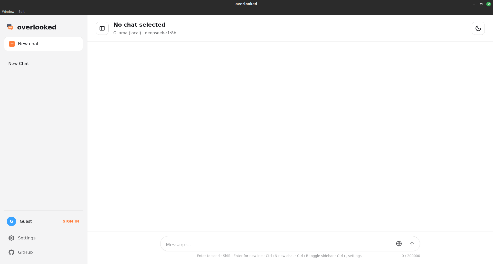
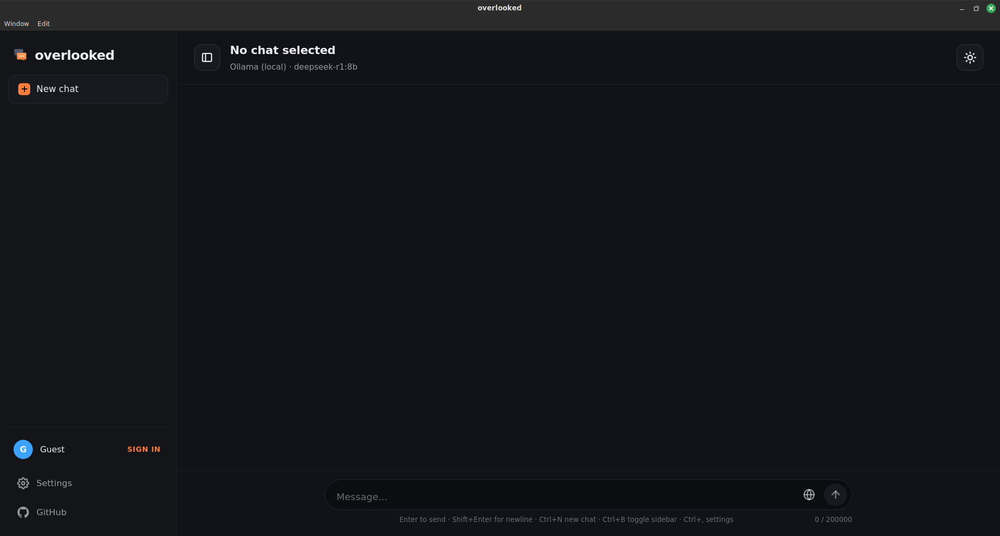
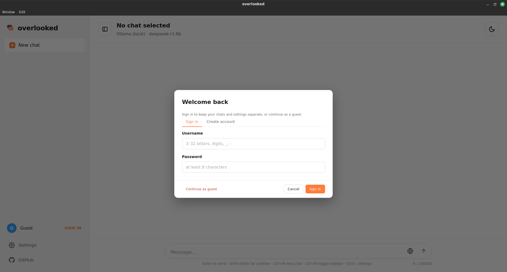
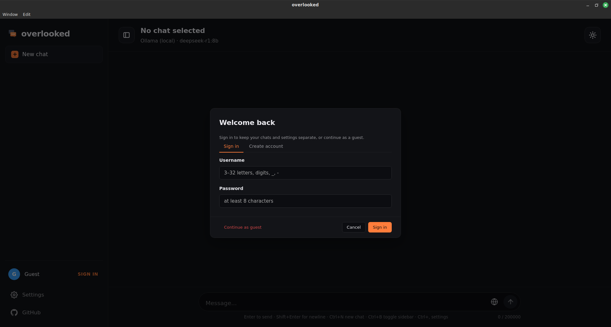
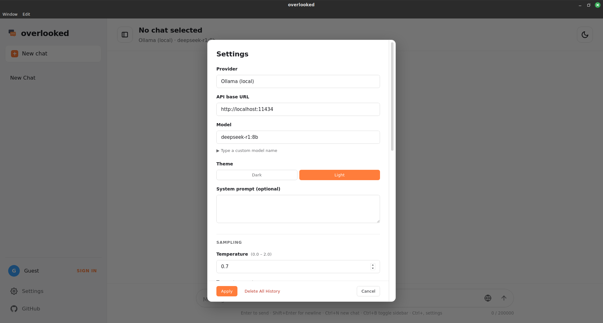
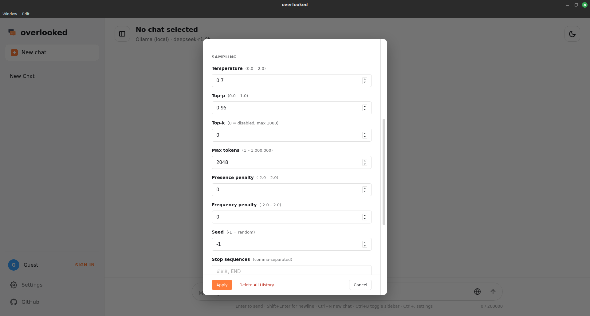
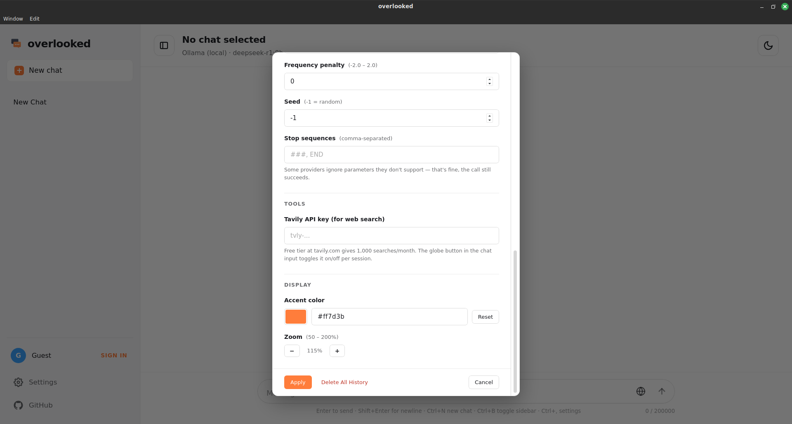
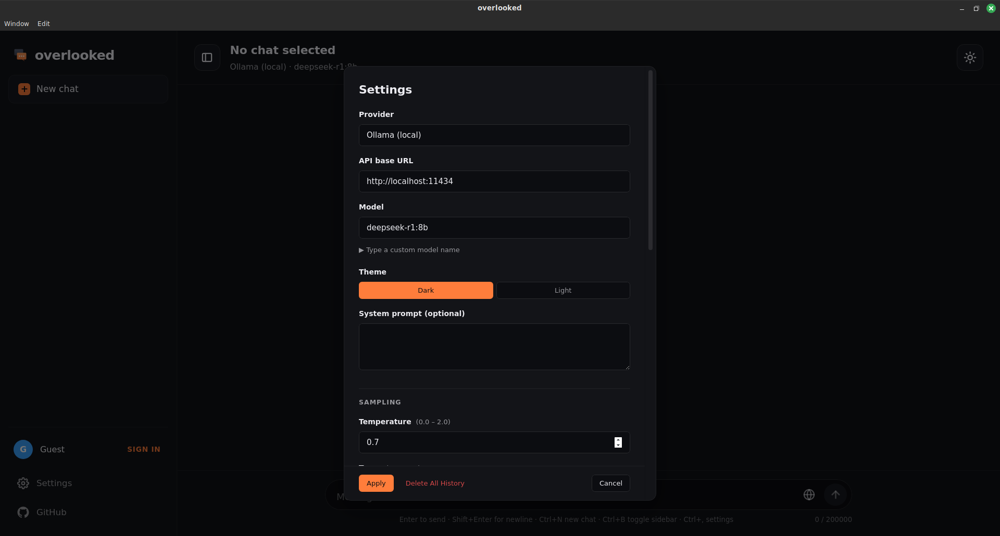

# overlooked — Screenshots

Visual tour of the app. All shots are from the live build.

## Main view

### Light theme

### Dark theme

## Sign in

### Light

### Dark

## Settings

The settings modal scrolls; here are three sections in light theme plus the dark equivalent.

### Light — Provider, model, theme

### Light — Sampling controls

### Light — Tools and display

### Dark — Settings

---

← Back to [main README](../README.md)
